# Review Feature Context

Analyze the feature context and provide strategic insights on progress, risks, and recommendations.

## Instructions

You are conducting a feature context review to assess health and identify issues.

### Step 1: Read Current Context

Load: `specs/{feature-id}/.feature-context.md`

Extract key information:
- Current WIP count
- Story statuses (completed, in-progress, blocked)
- Active branches and agents
- Recent progress log entries
- Documented dependencies

### Step 2: Analyze Progress

**Velocity Analysis**:
```markdown
## Progress Analysis

**Completed Stories**: X of Y (Z%)
**Average Time per Story**: [Calculate from progress log]
**Stories in Flight**: [Current WIP count]
**Blocked Stories**: [Count and list]

**Velocity Trend**:
- Stories completed last week: X
- Stories completed this week: Y
- Trend: [Increasing | Steady | Decreasing]
```

**WIP Distribution**:
```markdown
## WIP Analysis

**Current WIP**: X/3
**WIP Utilization**: [X/3 slots filled]

[If WIP < 3]
✅ Capacity available - can delegate more stories

[If WIP = 3]
⚠️ At capacity - wait for completion before new delegation

[If any stories blocked]
🚫 [N] stories blocked - investigate blockers
```

### Step 3: Identify Risks

**Dependency Risks**:
- Are there stories with unmet dependencies?
- Is any critical path blocked?
- Are there circular dependencies?

**Consistency Risks**:
- When were contracts last validated?
- Are there merge conflicts in active branches?
- Do active stories share overlapping code areas?

**Timeline Risks**:
- Is velocity trending down?
- Are stories taking longer than estimated?
- Are there accumulating blockers?

### Step 4: Provide Recommendations

Based on analysis, provide actionable recommendations:

```markdown
## Recommendations

### Immediate Actions (Do Now)
1. [Action with specific story/agent]
2. [Action with reasoning]

### Short-Term (This Week)
1. [Strategic action]
2. [Process improvement]

### Medium-Term (Next Sprint)
1. [Planning adjustment]
2. [Team coordination improvement]

### Risk Mitigation
1. [Address specific risk]
2. [Preventive measure]
```

## Review Template

```markdown
# Feature Context Review: [Feature Name]

**Review Date**: [Timestamp]
**Reviewer**: Feature Lead
**Feature Status**: [Current status]

## Executive Summary

[2-3 sentence overview of feature health]

## Progress Metrics

**Timeline**:
- Started: [Date]
- Target Completion: [Date]
- Days Elapsed: [X]
- Days Remaining: [Y]

**Story Completion**:
- Total Stories: [N]
- Completed: [X] (Z%)
- In Progress: [Y]
- Blocked: [Z]
- Not Started: [W]

**Velocity**:
- Stories per week: [Average]
- Estimated completion: [Date based on velocity]

## Health Indicators

### 🟢 Green Flags
- [Positive indicator 1]
- [Positive indicator 2]

### 🟡 Yellow Flags (Monitor)
- [Concerning pattern 1]
- [Concerning pattern 2]

### 🔴 Red Flags (Action Required)
- [Critical issue 1]
- [Critical issue 2]

## Detailed Analysis

### WIP Status
**Current**: X/3 slots filled
**Agents Active**: [List agents and their stories]

[Analysis of WIP utilization and balance]

### Dependency Chain

```mermaid
graph TD
  US001[US-001 ✅] --> US002[US-002 🔄]
  US002 --> US003[US-003 ⏳]
```


**Critical Path**: US-001 → US-002 → US-003
**Blockers**: [Any blockers on critical path]

### Story-Level Insights

**US-001**: ✅ Completed
- Merged: [Date]
- Quality: [Brief assessment]
- Handoff: [Status of handoff to dependent stories]

**US-002**: 🔄 In Progress
- Agent: [Name]
- Started: [Date]
- Progress: [Estimate %]
- Risks: [Any concerns]

**US-003**: ⏳ Not Started
- Dependencies: [What's needed first]
- Readiness: [Can start when...]

## Consistency Assessment

**Last Validated**: [Date]

**Contract Status**:
- API schemas: [Up to date | Needs sync]
- TypeScript types: [Aligned | Conflicts]
- Database migrations: [Compatible | Review needed]

**Recommended Actions**:
- [ ] Run consistency validation
- [ ] Update API contracts
- [ ] Resolve type conflicts

## Risk Assessment

### High-Priority Risks
1. **[Risk Name]**
   - **Impact**: [Critical | High | Medium]
   - **Likelihood**: [High | Medium | Low]
   - **Mitigation**: [Action plan]

### Medium-Priority Risks
[List with mitigations]

## Recommendations

### Immediate (Today)
1. ✅ [Actionable item with owner]
2. ⚠️ [Risk mitigation with priority]

### This Week
1. [Strategic action]
2. [Process improvement]

### Next Sprint
1. [Planning adjustment]
2. [Team coordination]

## Next Review

**Scheduled**: [Date]
**Triggers for Early Review**:
- WIP drops to 0 (no active work)
- Critical blocker emerges
- Feature status changes
```

## Review Frequency

**Regular Reviews**: Every 2-3 days
**Triggered Reviews**:
- After story completion
- When blocker identified
- When WIP changes significantly (±2 stories)
- Before major milestone

## Key Questions to Answer

1. **Progress**: Are we on track for target completion?
2. **Quality**: Are stories meeting acceptance criteria?
3. **Risks**: What could derail the feature?
4. **Resources**: Is WIP optimally utilized?
5. **Dependencies**: Are handoffs working smoothly?
6. **Consistency**: Are stories aligned?

---

**Remember**: Regular context review prevents surprises and enables proactive coordination.
