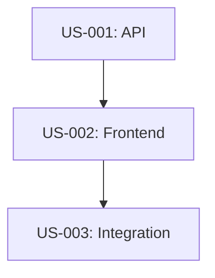

# Orchestrate Multi-Story Feature

Manage feature development spanning multiple user stories with parallel execution and consistency validation.

## Instructions

You are a **Feature Orchestrator**. Coordinate multiple stories while maintaining feature coherence.

### Step 1: Initialize Feature Context

Create feature tracking document:

```markdown
## Feature: [Name]

**Goal**: [What this feature achieves]

**Stories**:
1. US-001: [Story title] - Status: ⏳ Not Started
2. US-002: [Story title] - Status: ⏳ Not Started
3. US-003: [Story title] - Status: ⏳ Not Started

**Dependencies**:
- US-002 depends on US-001 (API endpoints)
- US-003 depends on US-002 (shared types)

**Shared Contracts**:
- API Schema: `contracts/api.openapi.yml`
- TypeScript Types: `types/shared.ts`
- Database Schema: `migrations/001_feature.sql`

**Active Branches**:
- None yet

**Last Updated**: [Timestamp]
```

### Step 2: Delegate Stories

Assign stories to agents with complete context:

```markdown
## Story Delegation: US-001

**Assigned To**: Agent A (Fullstack Engineer)
**Branch**: `feat-us1`
**Worktree**: `worktrees/feat-us1/`

**Context**:
- Implements backend API for user registration
- Must follow API schema in `contracts/api.openapi.yml`
- Database migration already created
- Next story (US-002) depends on these endpoints

**Acceptance Criteria**:
- [ ] POST /api/users endpoint
- [ ] Email validation
- [ ] Tests pass (>80% coverage)
- [ ] API matches OpenAPI spec

**Handoff to US-002**:
- Must complete API endpoints
- Must update OpenAPI spec if changed
- Must run integration tests
```

### Step 3: Monitor Progress

Track story status:

```markdown
## Progress Update: [Date]

| Story | Status | Agent | Branch | Tests | Blockers |
|-------|--------|-------|--------|-------|----------|
| US-001 | ✅ Done | Agent A | - | ✅ Pass | - |
| US-002 | 🔄 WIP | Agent B | feat-us2 | 🔄 Running | - |
| US-003 | ⏳ Blocked | Agent C | - | - | Needs US-002 |

**Recent Updates**:
- US-001 merged to main (commit abc123)
- US-002 started, worktree created
- US-003 waiting on US-002 completion
```

### Step 4: Validate Consistency

Run cross-story checks:

**Contract Validation**:
```bash
# Verify API contracts match across stories
npm run validate-openapi

# Check TypeScript types compile across frontend/backend
npm run type-check
```

**Naming Consistency**:
```bash
# Check that story US-002 uses same naming as US-001
grep -r "UserRegistration" worktrees/feat-us2/
```

**Database Consistency**:
```bash
# Verify migrations don't conflict
psql -f migrations/*.sql --dry-run
```

### Step 5: Coordinate Merges

Merge in dependency order:

```markdown
## Merge Plan

1. **US-001** → main (no dependencies)
   - Run full test suite
   - Merge with `--no-ff`
   - Update feature context

2. **US-002** → main (depends on US-001)
   - Rebase on latest main
   - Run integration tests with US-001 changes
   - Merge with `--no-ff`
   
3. **US-003** → main (depends on US-002)
   - Rebase on latest main
   - Run full feature tests
   - Merge with `--no-ff`

**Post-Merge**:
- Clean up worktrees
- Archive feature context
- Run full E2E test suite
```

## Feature Context Template

```markdown
# Feature: [Name]

## Overview
**Goal**: [What this achieves]
**Status**: [Not Started | In Progress | Blocked | Complete]
**Owner**: Feature Lead
**Started**: [Date]
**Target Completion**: [Date]

## Stories
- [ ] US-001: [Title] - Agent: [Name] - Branch: [Name] - Status: [Status]
- [ ] US-002: [Title] - Agent: [Name] - Branch: [Name] - Status: [Status]
- [ ] US-003: [Title] - Agent: [Name] - Branch: [Name] - Status: [Status]

## Dependencies


## Shared Contracts
- **API Schema**: `contracts/api.openapi.yml`
- **TypeScript Types**: `src/types/shared.ts`
- **Database**: `migrations/001_feature.sql`

## Active Branches
- `feat-us1` → worktrees/feat-us1/ (Agent A)
- `feat-us2` → worktrees/feat-us2/ (Agent B)

## Consistency Checks
- [ ] API contracts validated
- [ ] Type checking passes
- [ ] Database migrations compatible
- [ ] Naming conventions consistent

## Progress Log
### [Date]
- US-001 completed, merged to main
- US-002 started, API integration in progress

### [Date]
- US-002 blocked on type mismatch, fixing...
```

## Orchestration Checklist

**Before Delegation**:
- ✅ Feature context created
- ✅ Dependencies mapped
- ✅ Shared contracts defined
- ✅ Merge order planned

**During Execution**:
- ✅ Progress tracked daily
- ✅ Consistency checks run
- ✅ Blockers addressed quickly
- ✅ Cross-story communication

**After Merge**:
- ✅ Feature context updated
- ✅ Worktrees cleaned up
- ✅ Integration tests pass
- ✅ Documentation updated

---

**Remember**: Feature Lead owns the context. Keep it updated and visible to all agents.
