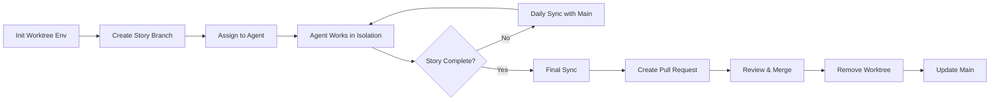

# Git Worktree Workflow

Enable parallel feature development by creating isolated working directories for each user story using `git worktree`. Multiple agents can work simultaneously without interfering with each other.

---

## Core Concept

**Git worktree allows multiple working directories from a single repository**

```
project/
├── .git/                    # Shared git repository
├── main/                    # Primary worktree (main branch)
├── worktrees/
│   ├── feat-us1/           # Story 1 branch (Agent A working here)
│   ├── feat-us2/           # Story 2 branch (Agent B working here)
│   └── feat-us3/           # Story 3 branch (Agent C working here)
```

**Benefits**:
- ✅ **No branch switching**: Each story has its own directory
- ✅ **No stashing**: Work in progress stays isolated
- ✅ **Parallel testing**: Run tests in multiple worktrees simultaneously
- ✅ **Clean separation**: Clear boundaries between story work

---

## Workflow

### 1. Initialize Worktree Environment

**Command**: `/worktree.init`

```bash
# Create worktrees directory structure
mkdir -p worktrees
echo "worktrees/" >> .gitignore

# List current worktrees
git worktree list
```

**Output**:
```
/path/to/project               abc1234 [main]
/path/to/project/worktrees/... (none)
```

---

### 2. Create Story Branch Worktree

**Command**: `/worktree.create <story-id> <branch-name>`

```bash
# Create new worktree for user story
git worktree add -b feat/us1-bird-search worktrees/feat-us1

# Navigate to story worktree
cd worktrees/feat-us1

# Verify isolation
git branch --show-current  # Output: feat/us1-bird-search
pwd                        # Output: .../worktrees/feat-us1
```

**Naming Convention**:
- Branch: `feat/<story-id>-<short-description>`
- Worktree directory: `worktrees/feat-<story-id>`
- Example: `feat/us1-bird-search` → `worktrees/feat-us1`

**Best Practices**:
- ✅ Create from latest `main` branch
- ✅ Use consistent naming scheme
- ✅ Document worktree → story mapping
- ❌ Don't create nested worktrees
- ❌ Don't manually edit `.git/worktrees/`

---

### 3. Work in Isolated Worktree

**Agents work independently in their assigned worktrees**

```bash
# Agent A in worktrees/feat-us1
cd worktrees/feat-us1
# Implement Story 1
git add . && git commit -m "feat(us1): implement bird search API"

# Agent B in worktrees/feat-us2 (simultaneous)
cd worktrees/feat-us2
# Implement Story 2
git add . && git commit -m "feat(us2): build search UI component"

# Agent C in worktrees/feat-us3 (simultaneous)
cd worktrees/feat-us3
# Implement Story 3
git add . && git commit -m "feat(us3): add result caching"
```

**Coordination Protocol**:
```markdown
## Worktree Assignment

| Story | Branch | Worktree | Agent | Status |
|-------|--------|----------|-------|--------|
| US1   | feat/us1-search-api | worktrees/feat-us1 | Agent-A | 🔄 WIP |
| US2   | feat/us2-search-ui  | worktrees/feat-us2 | Agent-B | 🔄 WIP |
| US3   | feat/us3-caching    | worktrees/feat-us3 | Agent-C | 🔄 WIP |
```

---

### 4. Sync with Main Branch

**Command**: `/worktree.sync <story-id>`

**Keep story branches up-to-date with main**

```bash
# From story worktree
cd worktrees/feat-us1

# Fetch latest main
git fetch origin main

# Rebase onto main (or merge if preferred)
git rebase origin/main

# If conflicts, resolve and continue
git rebase --continue

# Push updated branch
git push --force-with-lease origin feat/us1-bird-search
```

**Sync Schedule**:
- Daily: Sync all WIP story branches with main
- Before merge: Final sync before pull request
- After main merge: Sync remaining WIP stories

---

### 5. Merge Story Branch

**Command**: `/worktree.merge <story-id>`

**Two-step merge process**:

#### Step 1: Prepare for Merge
```bash
# Ensure story is complete and tested
cd worktrees/feat-us1
npm test  # All tests pass

# Final sync with main
git fetch origin main
git rebase origin/main

# Push to remote
git push origin feat/us1-bird-search
```

#### Step 2: Create Pull Request
```bash
# Use GitHub CLI or API
gh pr create \
  --base main \
  --head feat/us1-bird-search \
  --title "feat(us1): Natural language bird search API" \
  --body "Implements User Story 1: Search API endpoint with OpenAI embeddings"

# Or create via web UI
```

#### Step 3: Merge and Clean Up
```bash
# After PR approval and merge
git worktree remove worktrees/feat-us1
git branch -d feat/us1-bird-search

# Update main worktree
cd ../main
git pull origin main
```

---

### 6. Handle Conflicts

**Command**: `/worktree.conflicts <story-id>`

**Detection**:
```bash
# Before merge, check for conflicts
cd worktrees/feat-us1
git fetch origin main
git merge-base HEAD origin/main  # Find common ancestor
git diff origin/main...HEAD      # Show differences

# Simulate merge
git merge --no-commit --no-ff origin/main
# If conflicts, git will show them
git merge --abort  # Cancel simulation
```

**Resolution Strategy**:
```markdown
## Conflict Resolution Protocol

1. **Identify conflict type**:
   - File-level: Same file modified in multiple stories
   - API-level: Incompatible API changes
   - Schema-level: Database schema conflicts

2. **Resolution approach**:
   - **File conflicts**: Manual merge with context from both stories
   - **API conflicts**: Feature lead decides canonical API contract
   - **Schema conflicts**: Coordinate migration across stories

3. **Prevention**:
   - Design stories with minimal overlap
   - Use feature orchestration to detect conflicts early
   - Sync daily with main branch
```

---

### 7. Monitor Worktrees

**Command**: `/worktree.status`

```bash
# List all worktrees
git worktree list

# Show worktree details
git worktree list --porcelain

# Check disk usage
du -sh worktrees/*
```

**Expected Output**:
```
/path/to/project               abc1234 [main]
/path/to/project/worktrees/feat-us1  def5678 [feat/us1-bird-search]
/path/to/project/worktrees/feat-us2  ghi9012 [feat/us2-search-ui]
/path/to/project/worktrees/feat-us3  jkl3456 [feat/us3-caching]
```

---

## Worktree Lifecycle



---

## Commands Reference

| Command | Purpose | Example |
|---------|---------|---------|
| `/worktree.init` | Initialize worktree environment | `git worktree list` |
| `/worktree.create` | Create story branch worktree | `git worktree add -b feat/us1 worktrees/feat-us1` |
| `/worktree.sync` | Sync worktree with main | `git rebase origin/main` |
| `/worktree.merge` | Merge story branch to main | `gh pr create ...` |
| `/worktree.conflicts` | Check for merge conflicts | `git diff origin/main...HEAD` |
| `/worktree.status` | Monitor all worktrees | `git worktree list` |
| `/worktree.remove` | Clean up completed worktree | `git worktree remove worktrees/feat-us1` |

---

## Best Practices

### ✅ Do This

- **One worktree per story**: Maintain clear boundaries
- **Sync daily**: Keep worktrees up-to-date with main
- **Clean up promptly**: Remove worktrees after merge
- **Document assignments**: Track which agent owns which worktree
- **Test in isolation**: Run tests in each worktree independently

### ❌ Don't Do This

- **Share worktrees**: One worktree = one agent
- **Nest worktrees**: Keep all worktrees at same level
- **Forget cleanup**: Old worktrees waste disk space
- **Skip syncing**: Leads to large merge conflicts later
- **Mix stories**: Keep one story per worktree/branch

---

## Troubleshooting

### Issue: "Cannot create worktree (already exists)"
```bash
# Remove old worktree first
git worktree remove worktrees/feat-us1 --force
# Then recreate
git worktree add -b feat/us1-new worktrees/feat-us1
```

### Issue: "Worktree is locked"
```bash
# Unlock worktree
rm .git/worktrees/feat-us1/locked
# Or remove and recreate
git worktree remove worktrees/feat-us1 --force
```

### Issue: "Too many worktrees (disk space)"
```bash
# Check disk usage
du -sh worktrees/*

# Remove completed worktrees
git worktree prune

# Remove unused branches
git branch -d feat/us1-old feat/us2-old
```

---

## Integration with Feature Orchestration

**Worktree workflow enables parallel execution of feature orchestration**:

```
Feature Orchestration (WIP Limit: 3)
    ↓
Story 1 → worktrees/feat-us1 (Agent A)
Story 2 → worktrees/feat-us2 (Agent B)
Story 3 → worktrees/feat-us3 (Agent C)
    ↓
Daily Sync with Main
    ↓
Story 1 Complete → Merge → Remove Worktree
    ↓
Story 4 → worktrees/feat-us4 (Agent A reused)
```

**Coordination Points**:
1. **Feature lead creates worktrees**: One per active story
2. **Agents assigned to worktrees**: Clear ownership
3. **Daily sync enforced**: Feature lead coordinates
4. **Merge coordination**: Feature lead validates consistency
5. **Cleanup automation**: Remove worktrees after merge

---

## Success Metrics

- ✅ **Zero context switching**: Agents never change branches
- ✅ **Parallel throughput**: 3 stories in progress simultaneously
- ✅ **Minimal conflicts**: Early detection and resolution
- ✅ **Fast merges**: Pre-validated story branches
- ✅ **Clean repository**: Worktrees cleaned up promptly