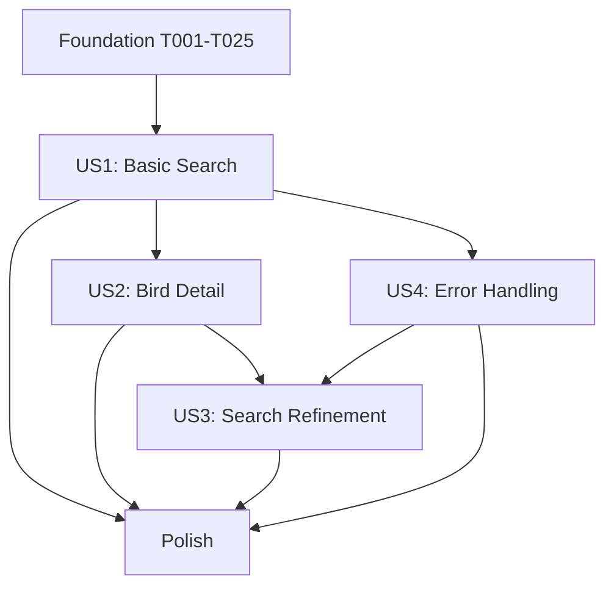

# Feature Context: Natural Language Bird Search Interface

**Feature ID**: 001-bird-search-ui  
**Lead**: Feature Lead Agent  
**Started**: 2025-12-24  
**Last Updated**: 2025-12-24  

---

## Status Dashboard

| Metric | Value |
|--------|-------|
| **Current Phase** | Phase 1-2: Foundation |
| **Active WIP** | 0/3 |
| **Stories Complete** | 0/4 |
| **Tasks Complete** | 0/90 |
| **Blockers** | None |

---

## User Story Status

| Story | Priority | Status | Assignee | Branch | Progress |
|-------|----------|--------|----------|--------|----------|
| Foundation | P0 | ⏳ Pending | - | 001-bird-search-ui | 0/25 |
| US1 | P1 🎯 | 🔒 Blocked | - | - | 0/23 (blocked by foundation) |
| US2 | P2 | 🔒 Blocked | - | - | 0/12 (blocked by US1) |
| US4 | P2 | 🔒 Blocked | - | - | 0/9 (blocked by US1) |
| US3 | P3 | 🔒 Blocked | - | - | 0/7 (blocked by US1, US2) |
| Polish | P4 | 🔒 Blocked | - | - | 0/14 (blocked by all) |

---

## WIP Tracker (Max 3 Concurrent)

| Slot | Story | Agent | Worktree | Status | Started | ETA |
|------|-------|-------|----------|--------|---------|-----|
| 1 | Foundation | Fullstack Engineer | 001-bird-search-ui | 🔄 WIP | 2025-12-24 | TBD |
| 2 | - | - | - | Available | - | - |
| 3 | - | - | - | Available | - | - |

**Current WIP**: 1/3 (Foundation blocks all user stories)

---

## Phase Progress

### Phase 1: Setup (T001-T009) ⏳ Not Started
- [ ] T001 Create root project structure
- [ ] T002 [P] Initialize backend project
- [ ] T003 [P] Initialize frontend project
- [ ] T004 [P] Install backend dependencies
- [ ] T005 [P] Install frontend dependencies
- [ ] T006 [P] Create shared types directory
- [ ] T007 [P] Configure ESLint/Prettier
- [ ] T008 Create .env.example files
- [ ] T009 [P] Setup .gitignore

### Phase 2: Foundational (T010-T025) ⏳ Not Started
- [ ] T010 Create database schema
- [ ] T011 Create migration framework
- [ ] T012 [P] Implement SQLite client wrapper
- [ ] T013 [P] Create eBird taxonomy download script
- [ ] T014 Create taxonomy seeding script
- [ ] T015 Create Macaulay image fetching script
- [ ] T016 Create embeddings generation script
- [ ] T017 [P] Implement logging service
- [ ] T018 [P] Implement sanitization middleware
- [ ] T019 [P] Implement error handling middleware
- [ ] T020 [P] Implement rate limiting middleware
- [ ] T021 [P] Setup Express/Fastify server
- [ ] T022 [P] Create shared TypeScript types
- [ ] T023 [P] Setup React Router
- [ ] T024 [P] Setup TanStack Query
- [ ] T025 [P] Create API client wrapper

**GATE**: Foundation must be complete before US1 can start.

---

## Cross-Story Dependencies

---

## API Contracts (from spec)

| Endpoint | Method | Story | Status |
|----------|--------|-------|--------|
| `/api/v1/search` | POST | US1, US4 | Not implemented |
| `/api/v1/birds/:id` | GET | US2 | Not implemented |
| `/api/v1/taxonomy` | GET | US1 | Not implemented |

---

## Key Technical Decisions

1. **Database**: SQLite with sqlite-vss for MVP → PostgreSQL + pgvector for production
2. **Embeddings**: OpenAI text-embedding-3-small (1536 dimensions)
3. **Framework**: React 18 + Vite + Vitest (frontend), Express/Fastify (backend)
4. **State**: TanStack Query for server state, URL params for navigation state

---

## Consistency Checkpoints

| Checkpoint | Validation | Last Checked |
|------------|------------|--------------|
| TypeScript strict mode | All projects compile with zero errors | Not yet |
| API contracts | OpenAPI spec matches implementation | Not yet |
| Shared types | Frontend/backend use identical interfaces | Not yet |
| Test coverage | ≥80% for all services | Not yet |
| Constitution compliance | All 5 principles satisfied | Not yet |

---

## Blockers & Risks

| ID | Description | Impact | Mitigation | Status |
|----|-------------|--------|------------|--------|
| - | None currently | - | - | - |

---

## Event Log

| Timestamp | Event | Details |
|-----------|-------|---------|
| 2025-12-24 | Feature initialized | Context document created, ready for delegation |

---

## Handoff Protocol

### Foundation → US1
- [ ] Database schema created and migrated
- [ ] eBird taxonomy seeded (500-1000 species)
- [ ] Embeddings pre-computed for all birds
- [ ] Express server running with middleware
- [ ] Shared types exported

### US1 → US2
- [ ] POST /api/v1/search working
- [ ] Bird model with full taxonomy
- [ ] BirdCard component rendering
- [ ] Search → Click navigation functional

### US1 → US4
- [ ] SearchService.search() method
- [ ] Zero results detection
- [ ] Error response format

### US2 + US4 → US3
- [ ] Bird detail page complete
- [ ] Error handling complete
- [ ] URL state management working
